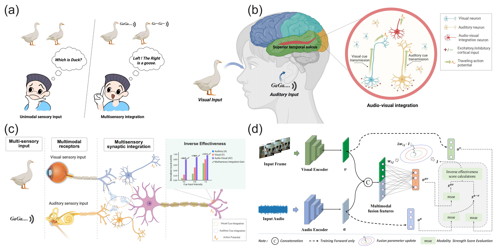

<div align="center">
<h2 class="papername"> Incorporating brain-inspired mechanisms for multimodal learning in artificial intelligence </h2>
<div>
<div>
    <a href="https://scholar.google.com/citations?user=Em5FqXYAAAAJ" target="_blank">Xiang He*</a>,
    <a href="https://scholar.google.com/citations?user=2E9Drq8AAAAJ" target="_blank">Dongcheng Zhao*</a>,
    <a href="https://scholar.google.com/citations?user=3QpRLTgAAAAJ" target="_blank">Yang Li</a>,
    <a href="https://scholar.google.com/citations?user=Sv-WdBkAAAAJ" target="_blank">Qingqun Kong†</a>,
    <a href="https://ieeexplore.ieee.org/author/37085719247" target="_blank">Xin Yang†</a>,
    <a href="https://scholar.google.com/citations?user=Rl-YqPEAAAAJ" target="_blank">Yi Zeng†</a>
</div>
Institute of Automation, Chinese Academy of Sciences, Beijing<br>
*Equal contribution
†Corresponding author

\[[arxiv]()\] \[[paper]()\] \[[code](https://github.com/Brain-Cog-Lab/BIM-for-MM)\]

</div>
<br>

</div>

Here is the PyTorch implementation of our paper. 
If you find this work useful for your research, please kindly cite our paper and star our repo.


## Method

We propose an inverse effectiveness driven multimodal fusion (IEMF) method, which dynamically adjusts the update dynamics of the multimodal fusion module based on the relationship between the strength of individual modality cues and the strength of the fused multimodal signal.




## Usage

```bash
+--- Audio Visual Classification 
+--- Audio Visual Continual Learning
\--- Audio Visual Question Answering
```

Three folders provide three tasks each. They contain detailed **run scripts for each task, drawing programs, and the way to download the corresponding dataset.** 

We also upload the weights of the trained model, as well as the log files from the training process here to ensure reproduction of the results in the paper. You can find them [here]().


## Citation

If our paper is useful for your research, please consider citing it:

```bash
bibtex here
```


## Acknowledgements

The code for each of the three tasks refers to [OGM_GE](https://github.com/GeWu-Lab/OGM-GE_CVPR2022), [AV-CIL_ICCV2023](https://github.com/weiguoPian/AV-CIL_ICCV2023), [MUSIC_AVQA](https://github.com/GeWu-Lab/MUSIC-AVQA):, thanks for their excellent work!

If you are confused about using it or have other feedback and comments, please feel free to contact us via hexiang2021@ia.ac.cn. Have a good day!
